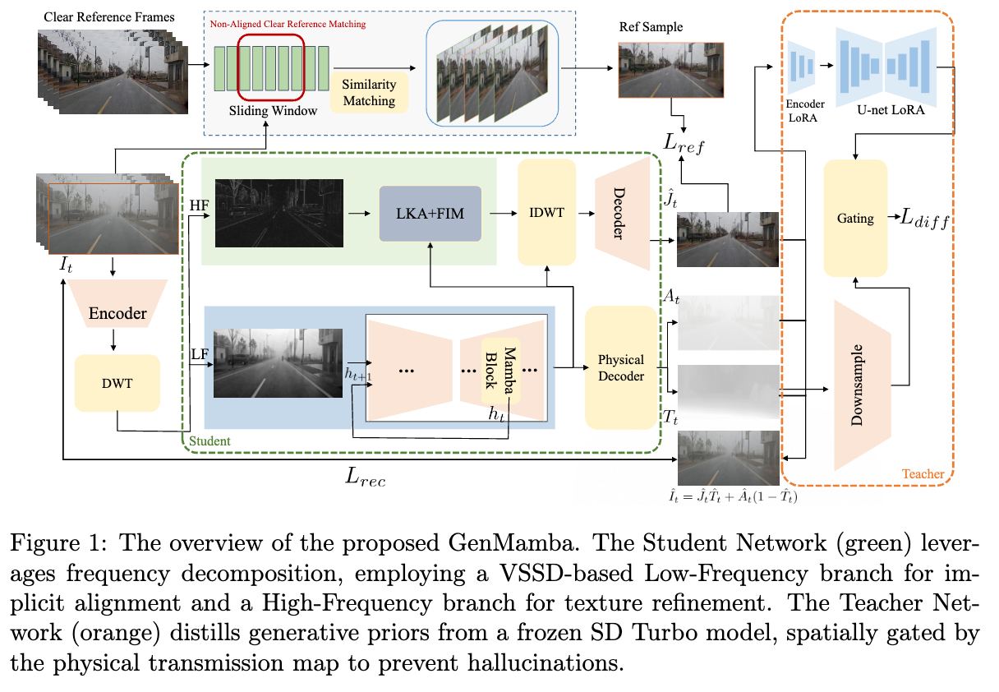

# GenMamba: Efficient Real-Time Video Dehazing via Physics-Gated Generative Distillation

  

## Overview

Real-time video dehazing remains a challenging problem in video technology because high-fidelity texture restoration often conflicts with efficient inference and temporal stability.  
GenMamba addresses this by introducing a **frequency-aware recursive architecture** that is designed for practical, real-time video restoration:

- **Recursive Mamba / VSSD-based implicit alignment** for efficient spatiotemporal modeling
- **Dual-branch frequency decoupling** to stabilize structure recovery and enhance textures
- **Physics-Gated Latent Distillation** for transferring generative priors while suppressing hallucinations
- **Alignment-Free Temporal Contrastive Regularization** for unsupervised learning on real-world videos

GenMamba achieves strong perceptual quality and temporal consistency on real-world video dehazing benchmarks, while maintaining **real-time efficiency (32.4 FPS)** and significantly reduced computational cost.

## Key Features

- Efficient real-time video dehazing with **32.4 FPS**
- Over **90% FLOPs reduction** compared with Transformer-based baselines
- Maintains temporal coherence without explicit optical flow
- Physics-guided generative enhancement for high-frequency textures
- Supports unsupervised training with non-aligned semantic reference matching

## Framework

The GenMamba framework follows a **teacher-student paradigm**:

- **Lightweight recursive Mamba student** for efficient video dehazing
- **Frozen diffusion teacher** providing generative priors during training only
- **Physics-Gated Latent Distillation** constraining generative guidance to degraded regions
- **Low-Frequency branch** modeling stable structure and temporal consistency
- **High-Frequency branch** enhancing textures via large-kernel refinement and cross-frequency interaction

  

> **Note:** The source code will be made publicly available upon acceptance of the paper. This repository currently provides a project overview, demonstration materials, and architecture illustrations associated with the submitted manuscript.
